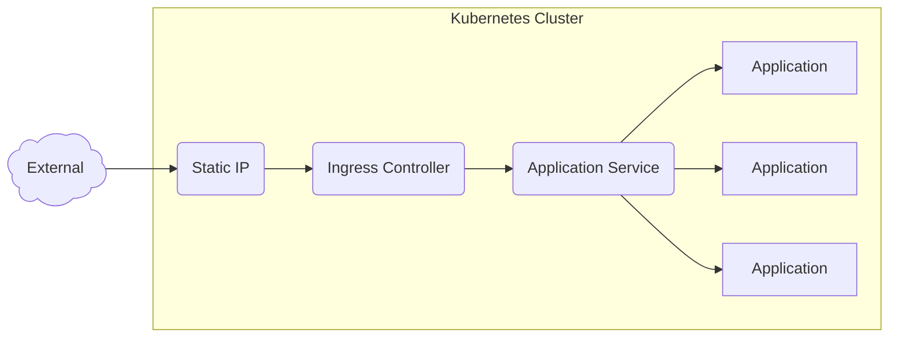

Happy new year! I wanted to give a rundown of what I've been messing around with. This may not be cyber security related per se, but knowing new technologies is part of the job. I've been messing around with Kubernetes lately, and if you are getting into application security then it behooves you to learn the concept of _at least_ the CI/CD (Continuous Integration/Continuous Delivery) pipeline. If you're a developer then I'm most likely not telling you anything you don't already know, but if you're in security like myself then learning Kubernetes is a whole other ball of wax.

One time I remember reading on reddit that someone referred to Kubernetes as "the final boss of IT." Not sure about that, but regardless Kubernetes really turns everything I've ever learned about IT on its head. The extremely abridged version is it's a deployment strategy for containerized software. But from a pragmatic point of view, rather than discuss all the implementations of Kubernetes from an enterprise point of view, I'm going to present it in a [hopefully] more relatable way: via a home lab setup!

Most implementations of Kubernetes (also referred to as K8s, just shorthand) show it running in some sort of cloud service. EKS (Elastic Kubernetes Service) from Amazon, AKS (Azure Kubernetes Service) for Microsoft Azure, and GKE (Google Kubernetes Engine) from Google are the big three to choose from, really. Though I personally run Kubernetes from [LKE](https://www.linode.com/products/kubernetes/) (Linode Kubernetes Engine), which is actually saving me money rather than having one monolithic server.

Not for this doc, however. I'm running it locally. Eff it, we'll do it live!

Now the standard way to run K8s, if you go by the docs on [Kubernetes.io](https://kubernetes.io), it will run on most popular linux distributions, and the basic way of installing it is by preparing your machines ahead of time (typically you'd want an odd number of control plane nodes and any number of worker nodes, so minimum of one machine...though what's the fun in that?), then using [kubeadm](https://kubernetes.io/docs/reference/setup-tools/kubeadm/) to prep each of them. I've done this process before, and admittedly it's not _too_ bad, but it invites a lot of nuance to the whole process that forces you to be a bit proactive. By that I mean that updating your OS via standard package management _shouldn't_ touch any part of the Kubernetes environment, so your upgrade process now adds a few more additional steps. This is just something that ops management should handle over the development portion, but since this is just a homelab it's something to keep in mind.

Kubeadm is fine enough for most, but I wanted something that was a bit more set-it-and-forget it. My first instinct was to install [K3s](https://k3s.io/), which is just a really awesome product for neato IOT edge devices like Raspberry Pis, and this is actually where I started. I bought 4 Raspberry Pis and installed K3s on all of them as my starting K8s cluster. K3s is great for things like that, but it is self-described as a lightweight version of Kubernetes, designed entirely for optimization on edge devices. I wanted to know what I was missing from the real thing (spoiler alert, honestly not a whole lot, K3s is great). Before that point however, I ran it on the aforementioned Raspberry Pis and decided to try my hand at installing things in the cluster. It was a lot of trial and error (I'll spare you the details), but eventually I managed to get a few things working on it. It was a major achievement! I took a step back and said "Wow, I set up a Kubernetes cluster and ran something on it."

Before I achieved that though, I ran into something I didn't particularly enjoy dealing with: ARM.

Don't get me wrong, [ARM](https://en.wikipedia.org/wiki/ARM_architecture_family) has its uses. Apple adopted it completely, diving headfirst into that pool. It's great for battery life, and admittedly it really is great for that. But call me oldschool, call me a grandpa, whatever -- x86 and x86_64 will always be king. I have a macbook for work, but I found out the hard way at DEFCON one year (maybe another post about that eventually) that if I spin up Kali in a VM for the macbook that half of the applications that I use for pentesting just don't freakin work for ARM architecture! I'm sure I can get it to a point where the macbook is a "good enough" pentesting machine, but I'm sorry, there's just no school like the old school.

Still though, my main PC is x86_64, so the code I write is also compiled for x86. If I wanted anything to run on a Raspberry Pi, I needed to compile it for ARM. Luckily Go just works like that, but still...it caused me a lot of headache. And frankly I just wanted to compile, build the image, and run it in my cluster without having to do any weird ARM emulation/compilation dancing. My Raspberry Pis were not destined to be my Kubernetes endgame. On I go looking for the best alternative.

## Kubernetes Platforms

### Rancher Alternatives

K3s wasn't alone. [Rancher](https://www.rancher.com/), the original developer of K3s, also makes [RKE2](https://docs.rke2.io/), which is a more enterprise-ready version of Kubernetes. I liked this notion, just a concept of having a Kubernetes platform that installs just as easily as K3s. It also boasts some ticky-box-checking concepts like being able to pass the CIS Benchmarks without much intervention. That's great for enterprise, and one of those things you can sell to your boss if he or she is wavering on the concept of installing a K8s cluster. But the one thing I _didn't_ like was something a bit unconventional, rather that it takes some liberties of installing things into the cluster already that I didn't want them to. Notably for RKE2, it installs Nginx Ingress Controller for the Ingress portion (though it should be noted that since Nginx announced they are pulling out of the Ingress K8s game, Traefik should be the new Ingress Controller for RKE2 in mid 2026). I wanted a blank slate.

Enter [Talos](https://www.talos.dev/).

### Talos

If anyone's used Redhat OpenShift for local installations before, Talos shares a lot of similarities to it. Talos is a fairly unique operating system. The entire operating system is tailored _specifically_ to run Kubernetes. In fact, the OS itself is inaccessible interactively via a shell. If you want to configure the OS, you need to use [`talosctl`](https://docs.siderolabs.com/talos/v1.12/getting-started/talosctl). This binary interacts with an API endpoint to issue commands and configuration settings to the operating system. You'd use it to open a curses-style dashboard that shows the contents of `dmesg` and some additional output involving the available resources, etc. You provision the control plane, edit a default configuration yaml file that defines things like the IP address of the machine, its role in Kubernetes (whether it's a control plane node or a worker node), and any additional configuration options you'd need for it, and then you just issue a command to deploy the config file. This allows for cool IT things like defining the Infrastructure as Code! Create your config yaml and commit it to a repository. You're good to go.

## But wait, what exactly _is_ Kubernetes?

I'm getting excited about Talos, but I realize that I'm going to get so excited that I'm going to gloss over common Kubernetes concepts. I'm going to break it down as simply as I can.

Kubernetes is a cluster methodology. If you go back far enough, the similarities are uncanny to one of the original [Beowulf Clusters](https://en.wikipedia.org/wiki/Beowulf_cluster) back in the 90s. In a sense, it's multiple machines all operating as one. In this case, Kubernetes is an implementation of one of those Beowulf clusters, or High-Performance Computing clusters, in which one or more head nodes control the flow of everything going on in the worker nodes. I used to work in high performance computing and the concept was very similar. Most people would log into the head node, write their computationally-expensive application or script, and then issue commands with [MPICH](https://www.mpich.org/) to send to the controller using `mpiexec`, specifying "run this application on the following machines, using the following amount of processes, for the following amount of time."

Now that's just high-performance computing. This is Kubernetes. Instead of issuing commands to run for a certain type of parameters, we'll have a service running in a virtual environment of sorts, ready to load balance and manage many requests to a single endpoint. Instead of running expensive code, it will just handle many connections and balance the load automatically. So you can have one website running inside the K8s cluster that can auto-load balance! If you have hundreds of thousands of requests all being sent to one web server, Kubernetes can be configured to spin up more instances of the web server to handle the load automatically, and then spin down the instances when the load lightens.

That's Kubernetes in a nutshell. Obviously there are _many_ more features available to you, but this is the basic gist.

### How does it accomplish this?

Kubernetes works with containers, and containers _only_. You don't log into a K8s cluster and spin up services ad hoc. You have to define them declaratively, and you have to prepare them as an image ahead of time. That means that you should really learn how to use containers first. Docker is the first that comes to mind, and in fact Kubernetes at first employed Docker as the default container implementation. Ultimately however, Kubernetes started having needs that differed from Docker (whose primary focus was Docker Swarm, an alternative cluster implementation), so Docker gave their code to the Cloud Native Computing Foundation (CNCF), so they could implement ContainerD which was more focused on complying with the [Open Container Initiative](https://opencontainers.org/). This means that any containerization software _should_ work with Kubernetes so long as it complies completely with the OCI. K8s uses [ContainerD](https://containerd.io/) by default to run containers, which has its roots primarily in Docker. So really, docker containers should work in Kubernetes without an issue as long as you understand that while the images are built using Docker, ContainerD will be executing them inside the K8s cluster. So if you're ever doing any crazy under-the-hood tweaks to the runtime of containers, just understand that instead of issuing docker commands, you'd be issuing `ctr` or `crictl` commands. Still though, in an ideal world you'd never need to ever use these commands as `kubectl` should be used instead.

Now when you have many machines all working together in a Kubernetes cluster, as long as they are all up and in the `Ready` state, they all work together conceptually. Meaning if I have some process running on any of the worker nodes, it shouldn't matter to me the end-user as to which worker node it's running on. I just need to know the IP address and port of where that service is running so I can access it, if indeed it's a service that an end user can access.

I won't get too granular other than to say that Kubernetes works with some clever implementation of Network Namespaces and the Linux Kernel features like `cgroups` to implement connectivity to the individual containers. That way when you connect to an IP defined by the cluster and it should just route to where you want it to go, assuming you configured it properly.

Kubernetes has a few entities that I'll try and define here:

- Pod: The most basic unit in Kubernetes. Essentially, this is a unit that runs a container. In most implementations, a pod should only host a single container. However in more advanced implementations, a pod can hold more than one container, typically referred to as a `sidecar` container, which assists or alters the main container in some way. Additionally you can run `initcontainers` that execute some sort of script before the main container starts up as well as `ephemeral containers` which are even more esoteric, but in a vast majority of situations a pod typically just runs with one single container.
- ReplicaSet: This is a definition of _how many pods you want running at any given time_. Define a ReplicaSet and Kubernetes will ensure that the state you declare will always be running. If you specify 10 pods to run in parallel, it will start up as many pods to ensure that 10 are running, and it will terminate as many pods to ensure that _at least_ 10 are running. Generally speaking, you won't typically define a ReplicaSet, rather you'd define the state in the Deployment.
- DaemonSet: This ensures that pods will run on specific machines within the cluster. Useful if there are any physical parameters you want to make sure are handled, like a specific network cable being plugged into one of the worker nodes, this will ensure that a pod starts in _that specific node_. Or all nodes. Depends on what you want. 
- Deployment: This is a higher-level implementation of a Pods and ReplicaSets. Generally speaking, _you typically will define both the pods and replicasets by declaring a deployment spec._ This deployment will state what pod it should start up, and how many of them should be present within the cluster. In most cases, you'd never define a pod or a replicaset in its own yaml files, but rather through this deployment file.
- Service: This is a networking concept in kubernetes that defines a point that you can access, and it will load balance from that point to any collective set of objects within the cluster. You can define the type of services here:
  - ClusterIP: An IP accessible _only_ from inside the Kubernetes cluster. If you are inside the cluster and you access the IP address generated from a ClusterIP service, it will route you to whatever pods are configured to route to.
  - NodePort: This is unique in that it will open a port on all the worker nodes, typically in the `30000-32767` port range, and connecting to that port will route to whatever pods the service is configured to route to. If you don't define a specific port, it will choose a random one within that range. This makes services accessible outside the cluster, and is commonly used for debugging purposes, though it can be used with an external load balancer too.
  - LoadBalancer: This is not enabled by default on Talos, you need to define a load balancer controller. In bare-metal implementations, that typically means installing [MetalLB](https://metallb.io/). This requests a new IP address outside the cluster, and any requests to that IP address and port definitions will be routed to whatever endpoint you define inside the cluster. All the big-name Kubernetes providers like Azure, Amazon, Google and Linode have their own Loadbalancer implementation, and requesting a new publicly-routed IP address will cost you a monthly fee. More info about that later.
- Storage Classes / Persistent Volumes / Persistent Volume Claims: This is the pain-point of most on-prem (or homelab) K8s implementations. Out of the box, Kubernetes does not come with any way of dealing with Persistent Storage, aside from rudimentary things like `localstorage`. Unless you're going with any of the big-name cloud providers, you'll have to figure out how persistent storage will be dealt with. Unless your pods are stateless websites or applications that don't need to store anything long term, you'll need to find some storage platform that works for you. In most cases, [Longhorn](https://longhorn.io/) should handle this for homelab stuff. It basically runs on every single node within your kubernetes cluster and utilizes the built-in hard disks on the machines to replicate data between all the machines, so even if your pod has to move to another node, it should have all of its data available to it. As I said, this is fine in most cases, but I went a little extra and implemented an ISCSI solution. ...Anyway, yeah once you set up a storage class, you define persistent volume pools for applications to take a piece from. Then each application you run within the cluster makes a persistent volume claim (PVC) to the pool to request a subset of that volume to use for itself.
- Ingress: This, combined with the Ingress Controller, will allow you to specify how you can connect to a service running within the cluster. This is for most implementations that have many applications running within the cluster, and instead of creating a new load balancer IP for each one, you just have one IP address and point it to a proxy application which handles the request and sends it to the appropriate service. This Ingress definition will be how the application should be accessed, such as through what hostname it should listen to, how the route should be processed, any headers it should add, etc.

Obviously there are plenty more, but a majority of what you'd deal with involves some of the above definitions. This is a lot, sure, but the basic flow chart looks like this:

