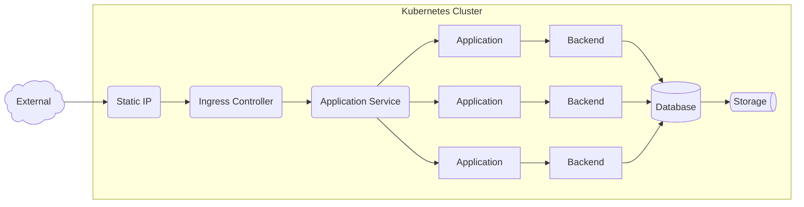
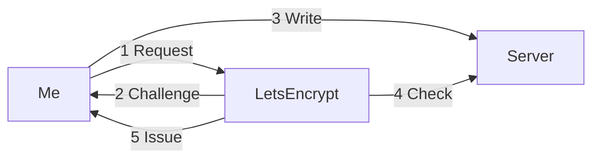

Happy new year! I wanted to give a rundown of what I've been messing around with. This may not be cyber security related per se, but understanding as many technologies as possible is part of the job. I've been messing around with Kubernetes lately, and if you are getting into application security then it behooves you to learn the concept of _at least_ the CI/CD (Continuous Integration/Continuous Delivery) pipeline. If you're a developer then I'm most likely not telling you anything you don't already know, but if you're in security like myself then learning Kubernetes is a whole other ball of wax.

One time I remember reading on reddit that someone referred to Kubernetes as "the final boss of IT." Not sure about that, but regardless Kubernetes really turns everything I've ever learned about IT on its head. The basic client-to-server paradigm is twisted considerably into something different altogether, where once the cluster is set up, the route from client to server is mostly a conceptual thing. The extremely abridged version is it's a deployment strategy for containerized software. But from a pragmatic point of view, rather than discuss all the implementations of Kubernetes from an enterprise point of view, I'm going to present it in a [hopefully] more relatable way: via a home lab setup!

Most implementations of Kubernetes (also referred to as K8s, just shorthand) show it running in some sort of cloud service. EKS (Elastic Kubernetes Service) from Amazon, AKS (Azure Kubernetes Service) for Microsoft Azure, and GKE (Google Kubernetes Engine) from Google are the big three to choose from, really. Though I personally run Kubernetes from [LKE](https://www.linode.com/products/kubernetes/) (Linode Kubernetes Engine), which is actually saving me money rather than having one monolithic server, since it automatically load balances to accommodate for higher traffic, spinning up new virtual nodes to handle more processes should the need arise.

Kubernetes is a love-it-or-hate-it architecture. In my experience, the people who love it will eat, sleep and breathe K8s. For those that hate it, they either heard it was complicated once and can't be bothered to learn new tech, or they've been forced to deal with it and all the upkeep that comes along with it that the very notion of maintaining a Kubernetes architecture conjures images of a vast hellscape of bloating issues that can give any admin a 1000-yard stare. They'll cite excuses like "it's too expensive" or "it's too much for what we're using it for," "we're not running a SAAS!" ...but honestly, Kubernetes is more than just a load balancing service. If nothing else, it is a _declarative end-state architecture that lends itself to an entire environment that can very easily be implemented as code._ That's right, you can just check the whole thing into a git repo and maintain everything from text files if you know what you're doing. The elegance of it all is just so cool to me, and that's why I decided to not only host my public site in a cloud-based K8s cluster, but also my own homelab on-prem.

For this doc though, I'll discuss running it locally. Eff it, we'll do it live! This document will be _kind of_ a how-to, but not really. Kubernetes is most decidedly very complex with a lot of moving parts, but just like every aspect of IT Infrastructure, it's something to learn. I can't explain every minute detail without having just a gigantic article that nobody will read, so this is more of a higher level overview of everything. I'll most likely add cheat sheets to managing Kubernetes in another article later.

Now the standard way to run K8s, if you go by the docs on [Kubernetes.io](https://kubernetes.io), it will run on most popular linux distributions, and the basic way of installing it is by preparing your machines ahead of time (typically you'd want an odd number of control plane nodes and any number of worker nodes, so minimum of one machine...though what's the fun in that?), then using [kubeadm](https://kubernetes.io/docs/reference/setup-tools/kubeadm/) to prep each of them. I've done this process before, and admittedly it's not _too_ bad, but it invites a lot of nuance to the whole process that forces you to be a bit proactive. By that I mean that updating your OS via standard package management _shouldn't_ touch any part of the Kubernetes environment, so your upgrade process now adds a few more additional steps. This is just something that ops management should handle over the development portion, but since this is just a homelab it's something to keep in mind.

`Kubeadm` is fine enough for most, but I wanted something that was a bit more set-it-and-forget it. My first instinct was to install [K3s](https://k3s.io/), which is just a really awesome product for neato IOT edge devices like Raspberry Pis, and this is actually where I started. I bought 4 Raspberry Pis and installed K3s on all of them as my starting K8s cluster. K3s is great for things like that, but it is self-described as a lightweight version of Kubernetes, designed entirely for optimization on edge devices. I wanted to know what I was missing from the real thing (spoiler alert, honestly not a whole lot, K3s is great). Before that point however, I ran it on the aforementioned Raspberry Pis and decided to try my hand at installing things in the cluster. It was a lot of trial and error (I'll spare you the details), but eventually I managed to get a few things working on it. It was a major achievement! I took a step back and said "Wow, I set up a Kubernetes cluster and ran something on it."

Before I achieved that though, I ran into something I didn't particularly enjoy dealing with: ARM.

Don't get me wrong, [ARM](https://en.wikipedia.org/wiki/ARM_architecture_family) has its uses. Apple adopted it completely, diving headfirst into that pool. Acid Burn was right, RISC Architecture is gonna change everything. It's great for battery life, and admittedly it really is great for that. But call me oldschool, call me a grandpa, whatever -- x86 and x86_64 will always be king. I have a macbook for work, but I found out the hard way at DEFCON one year (maybe another post about that eventually) that if I spin up Kali in a VM for the macbook that half of the applications that I use for pentesting just don't freakin work for ARM architecture! I'm sure I can get it to a point where the macbook is a "good enough" pentesting machine, but I'm sorry, there's just no school like the old school.

Still though, my main PC is x86_64, so the code I write is also compiled for x86. If I wanted anything to run on a Raspberry Pi, I needed to compile it for ARM. Luckily Go just works like that, but still...it caused me a lot of headache. And frankly I just wanted to compile, build the image, and run it in my cluster without having to do any weird ARM emulation/compilation dancing. My Raspberry Pis were not destined to be my Kubernetes endgame. On I go looking for the best alternative.

## Kubernetes Platforms

### Rancher Alternatives

K3s wasn't alone. [Rancher](https://www.rancher.com/), the original developer of K3s, also makes [RKE2](https://docs.rke2.io/), which is a more enterprise-ready version of Kubernetes. I liked this notion, just a concept of having a Kubernetes platform that installs just as easily as K3s. It also boasts some ticky-box-checking concepts like being able to pass the CIS Benchmarks without much intervention. That's great for enterprise, and one of those things you can sell to your boss if he or she is wavering on the concept of installing a K8s cluster. But the one thing I _didn't_ like was something a bit unconventional, rather that it takes some liberties of installing things into the cluster already that I didn't want them to. Notably for RKE2, it installs Nginx Ingress Controller for the Ingress portion (though it should be noted that since Nginx announced they are pulling out of the Ingress K8s game, Traefik should be the new Ingress Controller for RKE2 in mid 2026). I wanted a blank slate.

Enter [Talos](https://www.talos.dev/).

### Talos

If anyone's used Redhat OpenShift for local installations before, Talos shares a lot of similarities to it. Talos is a fairly unique operating system. The entire operating system is tailored _specifically_ to run Kubernetes. In fact, the OS itself is immutable, and thus inaccessible interactively via a shell. If you want to configure the OS, you need to use [`talosctl`](https://docs.siderolabs.com/talos/v1.12/getting-started/talosctl). This binary interacts with an API endpoint to issue commands and configuration settings to the operating system. You'd use it to open a curses-style dashboard that shows the contents of `dmesg` and some additional output involving the available resources, etc. You provision the control plane, edit a default configuration yaml file that defines things like the IP address of the machine, its role in Kubernetes (whether it's a control plane node or a worker node), and any additional configuration options you'd need for it, and then you just issue a command to deploy the config file. This allows for cool IT things like defining the Infrastructure as Code! Create your config yaml and commit it to a repository. You're good to go. This OS effectively turns your server into an appliance, in a sense.

## But wait, what exactly _is_ Kubernetes?

I'm getting excited about Talos, but I realize that I'm going to get so excited that I'm going to gloss over common Kubernetes concepts. I'm going to break it down as simply as I can.

Kubernetes is a cluster methodology. If you go back far enough, the similarities are uncanny to one of the original [Beowulf Clusters](https://en.wikipedia.org/wiki/Beowulf_cluster) back in the 90s. In a sense, it's multiple machines all operating as one. In this case, Kubernetes is an implementation of one of those Beowulf clusters, or High-Performance Computing clusters, in which one or more head nodes control the flow of everything going on in the worker nodes. I used to work in high performance computing and the concept was very similar. Most people would log into the head node, write their computationally-expensive application or script, and then issue commands with [MPICH](https://www.mpich.org/) to send to the controller using `mpiexec`, specifying "run this application on the following machines, using the following amount of processes, for the following amount of time." People would never log into the worker nodes, they only had an agent running on them that checked in with the head node to see if it was going to run any jobs for it. In fact, rebooting a worker node would PXE boot it into re-installing the OS, so the worker node was effectively ephemeral.

Now that's just high-performance computing. This is Kubernetes. Instead of issuing commands to run for a certain type of parameters, we'll have a service running in a virtual environment of sorts, ready to load balance and manage many requests to a single endpoint. Instead of running expensive code, it will just handle many connections and balance the load automatically. So you can have one website running inside the K8s cluster that can auto-load balance! If you have hundreds of thousands of requests all being sent to one web server, Kubernetes can be configured to spin up more instances of the web server to handle the load automatically, and then spin down the instances when the load lightens.

That's Kubernetes in a nutshell. Obviously there are _many_ more features available to you, but this is the basic gist.

### How does it accomplish this?

Kubernetes works with containers, and containers _only_. You don't log into a K8s cluster and spin up services ad hoc. You have to define them declaratively, and you have to prepare them as an image ahead of time. That means that you should really learn how to use containers first. Docker is the first that comes to mind, and in fact Kubernetes at first employed Docker as the default container implementation. Ultimately however, Kubernetes started having needs that differed from Docker (whose primary focus was Docker Swarm, an alternative cluster implementation), so Docker gave their code to the Cloud Native Computing Foundation (CNCF), so they could implement ContainerD which was more focused on complying with the [Open Container Initiative](https://opencontainers.org/). This means that any containerization software _should_ work with Kubernetes so long as it complies completely with the OCI. K8s uses [ContainerD](https://containerd.io/) by default to run containers, which has its roots primarily in Docker. So really, docker containers should work in Kubernetes without an issue as long as you understand that while the images are built using Docker, ContainerD will be executing them inside the K8s cluster. So if you're ever doing any crazy under-the-hood tweaks to the runtime of containers, just understand that instead of issuing docker commands, you'd be issuing `ctr` or `crictl` commands. Still though, in an ideal world you'd never need to ever use these commands as `kubectl` should be used instead.

Now when you have many machines all working together in a Kubernetes cluster, as long as they are all up and in the `Ready` state, they all work together conceptually. Meaning if I have some process running on any of the worker nodes, it shouldn't matter to me the end-user as to which worker node it's running on. I just need to know the IP address and port of where that service is running so I can access it, if indeed it's a service that an end user can access.

I won't get too granular other than to say that Kubernetes works with some clever implementation of Network Namespaces and the Linux Kernel features like `cgroups` to implement connectivity to the individual containers. That way when you connect to an IP defined by the cluster and it should just route to where you want it to go, assuming you configured it properly.

Kubernetes has a few entities that I'll try and define here:

- **Pod**: The most basic unit in Kubernetes. Essentially, this is a unit that runs a container. In most implementations, a pod should only host a single container. However in more advanced implementations, a pod can hold more than one container, typically referred to as a `sidecar` container, which assists or alters the main container in some way. Additionally you can run `initcontainers` that execute some sort of script before the main container starts up as well as `ephemeral containers` which are even more esoteric, but in a vast majority of situations a pod typically just runs with one single container.
- **ReplicaSet**: This is a definition of _how many pods you want running at any given time_. Define a ReplicaSet and Kubernetes will ensure that the state you declare will always be running. If you specify 10 pods to run in parallel, it will start up as many pods to ensure that 10 are running, and it will terminate as many pods to ensure that _at least_ 10 are running. Generally speaking, you won't typically define a ReplicaSet, rather you'd define the state in the Deployment.
- **DaemonSet**: This ensures that pods will run on specific machines within the cluster. Useful if there are any physical parameters you want to make sure are handled, like a specific network cable being plugged into one of the worker nodes, this will ensure that a pod starts in _that specific node_. Or all nodes. Depends on what you want. 
- **Deployment**: This is a higher-level implementation of a Pods and ReplicaSets. Generally speaking, _you typically will define both the pods and replicasets by declaring a deployment spec._ This deployment will state what pod it should start up, and how many of them should be present within the cluster. In most cases, you'd never define a pod or a replicaset in its own yaml files, but rather through this deployment file.
- **Service**: This is a networking concept in kubernetes that defines a point that you can access, and it will load balance from that point to any collective set of objects within the cluster. You can define the type of services here:
  - **ClusterIP**: An IP accessible _only_ from inside the Kubernetes cluster. If you are inside the cluster and you access the IP address generated from a ClusterIP service, it will route you to whatever pods are configured to route to.
  - **NodePort**: This is unique in that it will open a port on all the worker nodes, typically in the `30000-32767` port range, and connecting to that port will route to whatever pods the service is configured to route to. If you don't define a specific port, it will choose a random one within that range. This makes services accessible outside the cluster, and is commonly used for debugging purposes, though it can be used with an external load balancer too.
  - **LoadBalancer**: This is not enabled by default on Talos, you need to define a load balancer controller. In bare-metal implementations, that typically means installing [MetalLB](https://metallb.io/). This requests a new IP address outside the cluster, and any requests to that IP address and port definitions will be routed to whatever endpoint you define inside the cluster. All the big-name Kubernetes providers like Azure, Amazon, Google and Linode have their own Loadbalancer implementation, and requesting a new publicly-routed IP address will cost you a monthly fee. More info about that later.
- **Storage Classes / Persistent Volumes / Persistent Volume Claims**: This is the pain-point of most on-prem (or homelab) K8s implementations. Out of the box, Kubernetes does not come with any way of dealing with Persistent Storage, aside from rudimentary things like `localstorage`. Unless you're going with any of the big-name cloud providers, you'll have to figure out how persistent storage will be dealt with. Unless your pods are stateless websites or applications that don't need to store anything long term, you'll need to find some storage platform that works for you. In most cases, [Longhorn](https://longhorn.io/) should handle this for homelab stuff. It basically runs on every single node within your kubernetes cluster and utilizes the built-in hard disks on the machines to replicate data between all the machines, so even if your pod has to move to another node, it should have all of its data available to it. As I said, this is fine in most cases, but I went a little extra and implemented an ISCSI solution. ...Anyway, yeah once you set up a storage class, you define persistent volume pools for applications to take a piece from. Then each application you run within the cluster makes a persistent volume claim (PVC) to the pool to request a subset of that volume to use for itself.
- **Ingress**: This, combined with the Ingress Controller, will allow you to specify how you can connect to a service running within the cluster. This is for most implementations that have many applications running within the cluster, and instead of creating a new load balancer IP for each one, you just have one IP address and point it to a proxy application which handles the request and sends it to the appropriate service. This Ingress definition will be how the application should be accessed, such as through what hostname it should listen to, how the route should be processed, any headers it should add, etc.
- **Namespace**: A logical separation of deployments, services, replicasets, pods, etc. This can be useful if you want to restrict administrative access of some aspects of the cluster to certain people, or just organize things better. While you can access other services and pods from one namespace to another (unless you have restrictive networking in place), the only other thing that namespaces do not share are ConfigMaps and Secrets.
- **Configmaps**: Some block of arbitrary data that a pod can mount and access. You can use this to declaratively modify configuration options to a service running in a pod, among other things.
- **Secrets**: Sensitive data. Similar to configmaps conceptually, but these are used to store things like API keys, etc. Note that out of the box, secrets are stored in `etcd` in plaintext! Meaning if you have administrative access to `etcd`, the database that defines state in a Kubernetes cluster, you can dump all the secrets in plaintext. However, if a bad actor has admin access to your `etcd` database then you have a lot more problems than exposed credentials, to be perfectly honest.

Obviously there are plenty more, but a majority of what you'd deal with involves some of the above definitions. This is a lot, sure, but the basic flow chart of making a request to a service running in Kubernetes looks like this:


```mermaid
flowchart LR
    External@{ shape: cloud } -->LB(Static IP)
    subgraph Kubernetes Cluster
        LB --> ING(Ingress Controller)
        ING --> SVC(Application Service)
        SVC --> DEP1[Application]
        SVC --> DEP2[Application]
        SVC --> DEP3[Application]
        DEP1 --> Backend1[Backend]
        DEP2 --> Backend2[Backend]
        DEP3 --> Backend3[Backend]
        Backend1 --> Database@{ shape: cyl }
        Backend2 --> Database
        Backend3 --> Database
        Database --> Storage@{ shape: das }
    end
```

This is fairly basic, but basically 3 applications are spawned above to handle the front-end load of requests, and each request is sent to their own copy of the backend, which all relies on a single database endpoint, which has a storage volume assigned to it. And yes, you have to write a configuration for each aspect of the above diagram. Kubernetes is configured with YAML (or JSON, though it's not as user-friendly in this aspect). To add any of these services, you write these yaml files, then issue a `kubectl apply -f some_file.yaml` to the cluster in question. Of course, for this to work, you'll have to have a certificate that authenticates to the kubernetes cluster, which you should be able to generate on creation of the cluster.

## Preparing my Hardware

I'm not going to go into how to issue all the commands for it, but you can visit [Talos](https://www.talos.dev/) to find out how to do this step-by-step. But as for me, I obtained some old HP Mini PCs that I just stacked together, defined the one with the fewest resources as the control plane and installed Talos on it. Before I did anything worthwhile though, I had to decide how I was going to handle persistent storage. If you have a kubernetes cluster, you need to define a way to store data in some permanent way, and the first thing that comes to mind is Longhorn...but Longhorn sections off the local disk on each physical member of the cluster, and Talos is an immutable operating system. I know it's possible, but something seemed kinda hacky about that.

A friend of mine had upgraded his NAS and asked if I wanted his old Synology 2-bay NAS. I already have one for my own backups, but I couldn't pass up a free NAS. I dropped the money for some NAS-grade mechanical hard drives and set it up alongside my talos cluster. I officially had an ISCSI server for the cluster, so I could now provision persistent storage! Or...well I guess once I install the handler for it. Out of the box, Talos does not have the capability of connecting to an ISCSI server, so I need to install the proper packages. To do that, I need to build a customized image for Talos. Since Talos is immutable, I can't install packages on the system after the fact. I have to boot from an image that itself contains an artifact list of the packages that I need. So how do I do that? Why, use [the Talos Image Factory Service](https://factory.talos.dev/) of course.

From that site, I can safely define exactly what I want installed. It's a bare metal installation, I need `iscsi-tools` installed, I'm not using SecureBoot (because getting that running in HP minis was so frustrating I just gave up, it's a homelab after all), and I want the latest Talos. After I choose everything I need, it gives me a new page with links to specific installation media. I'm installing the control plane first, so I install the provided ISO file, wait until it boots fully, then use `talosctl` to configure everything from there on. I'd go through all the steps, but the documentation on [Talos' Website](https://talos.dev) are great, so I just followed the steps there. In the end, you'll wind up with a fully-working Talos setup once you bootstrap the `etcd` cluster and obtain the `kubeconfig` file. And for my own reference, I had to make changes to the `machineconfig.yaml` file that Talos generates for you to configure your system with, here are some of the edits I made, IPs changed to better reflect a standard homelab IP space:

```yaml
# Network portion
network: 
  interfaces:
    - deviceSelector:
        busPath: "0*"
      addresses: [192.168.0.0/24]
      routes:
        - network: 0.0.0.0/0
          gateway: 192.168.0.1
      dhcp: false
 
# DNS
nameservers:
  - 191.168.1.1
  - 1.1.1.1

# Install section, install OS to /dev/sdb for this particular machine, and also load
# the below image created at the image factory, and the provided hash points to the
# instructions to install iscsi tools in my case
install:
  disk: /dev/sdb 
  image: factory.talos.dev/metal-installer/613e1592b2da41ae5e265e8789429f22e121aab91cb4deb6bc3c0b6262961245:v1.12.1
  wipe: false 

# Kernel modules to load, note loading iscsi
kernel:
  modules:
    - name: iscsi_tcp
    - name: dm_thin_pool

# Only thing you really need to change is the controlplane endpoint URL and the cluster name. Leave everything else alone
# unless you have some really weird reason to change any of the below.
cluster:
  id: <don't touch this> 
  secret: <dont touch this either> 
  controlPlane:
    endpoint: https://k8s.agrohacksstuff.local  # Made this up
  clusterName: homelab-talos 
  network:
    dnsDomain: cluster.local 
    podSubnets:
      - 10.244.0.0/16
    serviceSubnets:
      - 10.96.0.0/12
  
  # Disabling Pod Security is probably frowned on in a prod environment
  apiServer:
    image: registry.k8s.io/kube-apiserver:v1.32.3 
    certSANs:
      - k8s.agrohacksstuff.local
    disablePodSecurityPolicy: true # Disable PodSecurityPolicy in the API server and default manifests.
```
> Note: Disabling Pod Security goes against most of what I'm about, though being that this is my home environment and I'm the only one touching it, I can enforce the security myself and ensure nothing runs as root, etc. I found it interesting that RKE2, something that complies with CIS Benchmarks without much alteration, does not enforce the level of Pod Security as Talos does. Live and learn I suppose.
{: .prompt-warning}


Now I have a kubernetes cluster and a Synology NAS box that I updated to the latest version and built a RAID-0 array with two 4-TB disks, then provisioned a new user named `iscsi` with a password that I would use for any application that would need persistent storage. Once I got Kubernetes up and running on the Talos cluster, I installed [Synology's CSI driver for Kubernetes](https://github.com/SynologyOpenSource/synology-csi). Getting this installed based on the instructions listed on their Github is interesting, as it's a Go binary that interacts with Synology's REST Api to provision new ISCSI LUNs for any time a persistent volume claim is requested. It's fairly simplistic but so far it worked without too much of a hassle. Just make sure you have the `iscsi-tools` package installed from the Talos image beforehand!

## Finally, a working Kubernetes Cluster!

Yup, it's done. Ready to accept whatever Kubernetes-related workload you can throw at it. Unfortunately though, it's missing some nice Quality-of-Life features, just a few more things before I can really start is getting a load balancer installed so I can get a static IP address, an Ingress controller to route things appropriately, and while I'm at it, why not get TLS certificates installed? So let's add a few additional things to really get ready for new applications.

## Load Balancer

The "Load Balancer" is Kubernetes I've always considered kind of a misnomer. I mean sure, it's doing some sort of load balancing, where you get one single IP address out of the deal and it will route traffic to an endpoint, but it's not _really_ doing much balancing of load. Maybe conceptually sure, since a Service in Kubernetes will distribute the traffic appropriately, but in the context of this, a `LoadBalancer` service type really just translates to "External IP that routes to an endpoint inside Kubernetes." To that end, that's all I really want to do here, especially because I want any traffic going to this IP address to just be sent to a proxy, which will route to the appropriate service. To accomplish this, Kubernetes doesn't do this out of the box. We'll need some sort of application that will accomplish this for us. For that, I defer to [MetalLB](https://metallb.io/).

Kubernetes already supports the _concept_ of the Load Balancer out of the box. But until you define a handler that will actually handle them, it will just remain in a "Pending" state. Not helpful. Of course, if you're running inside any of the big cloud provider kubernetes solutions, it will have a load balancer ready for you to use...and for every single IP address you request, they will charge you accordingly. Since I'm running bare metal, I'll need to set up my own load balancer. I _could_ use the `ExternalIPs` in the service spec, but that ties the service to specific IPs that the node itself owns, and frankly that's not what I need. I want a single IP address that isn't tied to specific nodes that will route to a specific service. MetalLB helps bridge that gap.

Installing MetalLB is easy, the site explains how to install it, and it runs pretty cleanly. It installs a copy of itself on every running node via a `DaemonSet`, and waits for you to configure it. I want to install it with FRR enabled, so I won't pick the "experimental FRR-K8s" version, and get it installed.

Once it's done, time to configure it. First, I'll define the `ipaddresspool` definition, where I'll tell MetalLB that if I'm going to request IP addresses, they are only to come from between `192.168.0.50` to `192.168.0.60`, just an arbitrary range:

```yaml
apiVersion: metallb.io/v1beta1
kind: IPAddressPool
metadata:
  name: my_ip_address_pool
  namespace: metallb-system
spec:
  addresses:
    - 192.168.0.50-192.168.0.60
```

Then, the Layer 2 Advertisement definition, which may not be necessary but just in case I can separate any additional IP address pools I might make later into different names. The site lists "cheap" versus "expensive" pools, ie cheap being in private IP space and expensive being publicly routable. Additionally, I can also specify which nodes specific IP addresses would listen on here, but that's for some more advanced setups. I don't want any of that stuff, but I am pedantic so here's a relatively useless specification:

```yaml
apiVersion: metallb.io/v1beta1
kind: L2Advertisement
metadata:
  name: my_l2adv_name
  namespace: metallb-system
spec:
  ipAddressPools:
    - my_ip_address_pool
```

And now I'm ready to host an IP address. I'll need an endpoint to set that up first, and the easiest one in my opinion is [Traefik](https://github.com/traefik/traefik), since it integrates so well into the Kubernetes Ecosystem. The goal here is I'll set up my Ingress controller, then I'll request an IP address that will connect directly to it, that way I can have Traefik handle all the routing. Theoretically I can set up different IPs for every service since this is running in my home lab, but in a realistic situation any external IP address should be considered expensive, and this is specifically what Traefik is built to handle anyway.

And to add to that, this is 2026, so no self-respecting web server should be running in plaintext, so I'll also set up a certificate tied to my domain. I bought a domain so I could use a certificate from [LetsEncrypt](https://letsencrypt.org/), so let's get that set up too.

## Ingress

_Back in my day_ we called these Reverse Proxies. They're still technically reverse proxies, but that name implies that it's HTTP/HTTPS only, and honestly it does so much more than it used to so I think they've earned the title Application Proxies. Ultimately, I'm going to install a service that handles all requests from outside the cluster to route them to the appropriate application, so it's arguably one of the most important applications to install inside the cluster. As stated previously, I'm going to use [Traefik](https://github.com/traefik/traefik). Many moons ago I administrated a reverse proxy called [Squid](https://www.squid-cache.org/), which effectively did the same thing. I don't see too many people using this for things like Kubernetes (or really much of anything unless you're setting up a forward proxy), but it should work in theory. Having set this up, I always figured that the reverse proxy capabilities of squid were very much an afterthought, as setting that up was a bear...at least compared to other projects like Nginx.

I'd even suggest using Nginx if they hadn't already announced that they're leaving the Kubernetes Ingress game due to development constraints. So much for that. Traefik however really approaches proxying a bit differently. So different in fact that I had to really sit down and learn it properly because it's just not something I'm used to. Generally I expect that if I install something like nginx, squid, apache, etc -- I'd go into it's directory under `/etc` and modify a config file specific to the application. Traefik is a bit more environment-aware, and instead is made to work with containers directly, or just straight-up Kubernetes. It accomplishes this by being granted elevated permissions within the environment. With Docker, you have to grant it access to `/var/run/docker.sock`, which for those security-conscious out there might be eyebrow-raising as obtaining access to this socket could potentially grant you root access on the main system. Still though, homelab, and this is a vetted and peer-reviewed project, so we have to afford some liberties there. But hey if you're threat-modeling this setup, keep that in mind I suppose.

Anyways, instead of manually editing the config of Traefik itself, instead you're _annotating_ or _labelling_ the services running inside of your cluster, or in the case of Docker, any container running on the system. So if you have a service that you want to expose from a website, you'd add that option in your container options. From their website:

```yaml
# whoami.yml
services:
  whoami:
    image: traefik/whoami
    labels:
      - "traefik.http.routers.whoami.rule=Host(`whoami.localhost`)"
```

Since Traefik has access to the Docker socket, it has the ability to read annotations appended to the services that start and can act on them accordingly. If you add this particular service in your `docker-compose.yml` file, Traefik will know that any request to `http://whoami.localhost` that it receives will route to the `whoami` container. It's up to you to ensure that your DNS server knows to route requests to that hostname to your machine. Though since it's using `localhost` it will automatically route to itself. Traefik operates similarly in Kubernetes, only the installation uses specific permissions to the manifests published to the cluster that allow it to work specifically with Ingress objects.

I can install Traefik with Helm (something I'll probably publish a cheat sheet about in the near future), as explained on their website. Once it's up and running, I'll need to switch gears to ensuring I have LetsEncrypt set up to automatically request a new certificate so I can use HTTPS now.

## Cert-Manager and LetsEncrypt

There are plenty of walkthroughs, specifically on [Cert-Manager's Website](https://cert-manager.io/) that explain how to set it up inside of Kubernetes, but with LetsEncrypt I need to specify a few things ahead of time. First of all, I'll need a domain. Then I'll need a way to prove to LetsEncrypt that I actually own that domain. They have two basic ways of accomplishing this. The first (arguably) more popular method is to have certbot answer a challenge by writing to a pre-defined place in the root of a hosted site. Problem here is the site must be publicly available, or at least visible to LetsEncrypt for this to work. I'm running locally and don't intend to expose any of it externally, so I'll have to go with Option 2: DNS challenges. Where when I make a request, LetsEncrypt will issue a challenge for me to write a TXT entry in a public DNS server for the domain that I claim to own. Since this is the better option and I don't have to expose a web server to the public, I'll choose this. For that I'll have to tell cert-manager to use a specific method for the domain service that's hosting my domain name so that it can automatically answer that challenge.

Just to recap, this is the challenge <--> response diagram for LetsEncrypt:


```mermaid
flowchart LR
    Me --> |1 Request| LetsEncrypt
    LetsEncrypt -->|2 Challenge| Me
    Me --> |3 Write|Server
    LetsEncrypt -->|4 Check|Server
    LetsEncrypt -->|5 Issue|Me
```

Now I'll have to figure out what Issuer I'm going to use. In the context of Cert-Manager, an issuer is the service that responds to the challenge from LetsEncrypt. I'll be using DNS01 for this, and I'll have to configure it to my DNS provider. For this I'll have to refer to Cert-Manager's documentation for configuring an issuer, and specifically to use the DNS01 Issuer for their ACME (Automatic Certificate Management Environment) issuer. Cert-Manager has documentation for most DNS and HTTP services that LetsEncrypt can reach out to to submit changes to answer the challenges. For the sake of my hypothetical environment, let's say I'm using DigitalOcean for DNS. I'd follow the [documentation at Cert-Manager](https://cert-manager.io/docs/configuration/acme/dns01/digitalocean/), and it involves two manifests. First and foremost, the Secret I need to generate. In this case, it would be the access token I'd need to use for cert-manager to use for authentication with Digital Ocean. So first, I'd need to base64-encode it, because for some reason this needs to be encoded to make a Kubernetes secret:

```terminal
$ echo -n "th1s_15_my_4cc3ss_t0k3n$" | base64
dGgxc18xNV9teV80Y2Mzc3NfdDBrM24=
```

Then I'd use that to create a new secret manifest. I can either do it straight from the command line:

```terminal
$ kubectl create secret generic digitalocean-dns --namespace cert-manager --from-literal=access-token=dGgxc18xNV9teV80Y2Mzc3NfdDBrM24=
```

...though keep in mind these are left on the command line history, so be careful of that. Otherwise, you can just create the manifest manually:

```yaml
apiVersion: v1
kind: Secret
metadata:
  name: digitalocean-dns
  namespace: cert-manager
data:
  access-token: dGgxc18xNV9teV80Y2Mzc3NfdDBrM24=
```

then apply it.

```terminal
$ kubectl apply -f <my-secret-manifest>.yaml
```

Now I have to create the issuer. Generally speaking, Cert-Manager will have all the specifics of _how_ it connects to digital ocean (or whatever you're using), so all you have to do is apply your newly generated secret to it:

```yaml
apiVersion: cert-manager.io/v1
kind: Issuer
metadata:
  name: letsencrypt-prod
spec:
  acme:
    solvers:
    - dns01:
        digitalocean:
          tokenSecretRef:
            name: digitalocean-dns
            key: access-token
```

The magic in the above comes from defining the secret as `access-token: blah`, naming it as `digitalocean-dns`, and then in the issuer line we're using `tokenSecretRef`, which is specific to the issuer that says "Check the digitalocean-dns secret and set the variable `key` to the variable named `access-token` in the digitalocean-dns secret."

Now that that's set up, let's create a wildcard certificate!

### Setting up the Wildcard Cert

So first let me discuss Wildcard Certificates and why _I think they're better._ I feel like most security people think wildcard certs are bad opsec, and frankly they might be in some regard. However before you get all high and mighty on me, know that every single certificate you register shows up [here](https:/crt.sh), as a [Certificate Transparency Log](https://certificate.transparency.dev/). A noble effort, but frankly an opsec nightmare if you just had no idea that every single cert and subdomain you've ever registered shows up here, even internally-generated ones in some cases. It's a scary rabbit hole to go down once you realize it exists, and it's definitely one of the typical OSINT steps when researching the background of an organization.

Scary stuff. So yeah, despite the fact that it can be used anywhere, I prefer using a wildcard cert rather than telling everyone what I'm using behind my firewall. Either way you have to juggle specialized certificate security but still OSINT-fodder, versus convenience but OSINT-obfuscation.

Besides, it's just easier to deal with one certificate. So I'll make a wildcard certificate _just for Traefik_.

Inside of the `traefik` namespace, I'll create the following manifest called `wildcard.cert.yaml` (though the filename doesn't really matter):

```yaml
apiVersion: cert-manager.io/v1
kind: Certificate
metadata:
  name: wildcard-agrohacksstuff.io
  namespace: traefik
spec:
  privateKey:
    rotationPolicy: Always
  secretName: wildcard-agrohacksstuff.io
  dnsNames:
    - "*.agrohacksstuff.io"
    - "agrohacksstuff.io"
  issuerRef:
    kind: ClusterIssuer
    name: letsencrypt-prod
    group: cert-manager.io
```

Then I'll use `kubectl apply -f wildcard.cert.yaml` and I'm off to the races. I can then view the progress....

```terminal
$ kubectl get cert wildcard-agrohacksstuff.io
NAME                           READY   SECRET                         AGE
wildcard-agrohacksstuff.io     False   wildcard-agrohacksstuff.info   32s
```

It's shown as not ready because I just submitted it. But it usually takes about a minute. I'll keep repeating that command and once it says it's ready, I'll tweak Traefik to use it!


## Configure Traefik to use the Wildcard Cert

Now we're cooking. Note that Traefik was built using Helm, so if we want to make any specific changes to it we'll need to create a `values.yaml` file with our custom changes to it. I'll go ahead and create a new file with a few changes that I looked up from [Traefik's Helm Chart Values.yaml reference sheet](https://github.com/traefik/traefik-helm-chart/blob/master/traefik/VALUES.md):

```yaml
ports:
  web:
    port: 80
  websecure:
    port: 443

providers:
  kubernetesGateway:
    enabled: true
  kubernetesIngress:
    enabled: true

gateway:
  enabled: true
  name: traefik-gateway

  listeners:
    web:
      port: 80
      protocol: HTTP
      namespacePolicy:
        from: All
    websecure:
      port: 443
      protocol: HTTPS
      namespacePolicy:
        from: All
      mode: Terminate
      certificateRefs:
        - kind: Secret
          name: wildcard-agrohacksstuff.io
```

The basic thing to understand about helm is that you can install something with all the defaults in place, but if you have specific needs for it (and you most likely will), then you can write a `values.yaml` file that effectively overwrites the defaults to the helm chart and it will install everything based on these new values. For the above I made a fair amount of changes, noting that I'm using both Ingress and the GatewayAPI here (another discussion later most likely), but the important stuff is everything under the `websecure` section, where I specifically mention to use the `wildcard-agrohacksstuff.io` secret.

Wait a minute, "Secret?" When did I make a secret? ...is probably what you're saying. Cert-manager did. When it creates a new TLS certificate, it stores it specifically as a TLS certificate! And you don't have to worry about cert expirations either, because Cert-Manager handles all the renewals for you, just like Certbot would.

Now for all your ingresses, as long as you specify that you're listening on TLS, it will default to the wildcard cert.

## Additional Applications

So this article is getting long enough so I think for any of the specifics, such as setting up `kubectl` and deploying additional applications will have to go in another article. At this point I'll make a cheat sheet on adding additional applications and example manifests that I can use. So just a few things that I use almost daily:

- [kubectx and kubens](https://github.com/ahmetb/kubectx) - These two are available in the same package, but makes it _so_ much easier to switch between more than one cluster, as well as switching between namespaces. Without making any config changes, you will default to the `default` namespace for when you run `kubectl` unless you specify otherwise, but `kubens` lets you easily change the context of the current namespace to whichever you want. It's kind of like `cd` for kubernetes.
- [k9s](https://k9scli.io/) - I can't even begin to explain how great this handy little app is. It's an ncurses interface to your entire kubernetes cluster, and you don't have to install anything on the cluster itself. You can do basically anything from here and it's really handy at giving you a good view of what's going on in your cluster, all the while using the standard kubernetes endpoint, not a web page!
- [kustomize](https://kustomize.io/) - This is a little more in depth, but when you're dealing with a complex application, kustomize will help you deploy the same application to more than one environment. Additionally you can do some other really cool stuff, like modify data in a configmap and have the cluster pick up the changes automatically if you configure it that way. This has gotten so popular that the Kubernetes project has added kustomize to the standard kubectl command, using `kubectl -k`! Though it is not as feature-rich as the kustomize package itself.
- [Argo CD](https://argo-cd.readthedocs.io/en/stable/) - This is one application you can choose to make your cluster gitops-worthy. You can define a state inside of a git repo and Argo CD will make sure that any changes it finds will be reflected on the cluster. This is primarily how I install any application in my cluster, rather than issue the apply command for every single manifest.
- [Flux](https://fluxcd.io/) - The alternative to Argo CD. This is the Emacs to ArgoCD's vim. I don't use this but I know many who swear by it.
- [Metrics Server](https://github.com/kubernetes-sigs/metrics-server) - This is an important one. Install this and forget about it, really. It's necessary to run `kubectl top node` or `kubectl top pod`, which will tell you which pod is using the most resources as well as how many of the available resources are being used on each successive node in the cluster. This is so easy to install that I decided to just link it in the Additional Applications section.